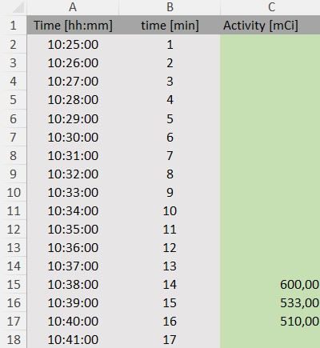
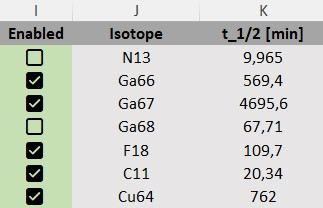
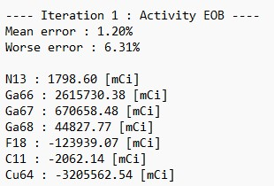
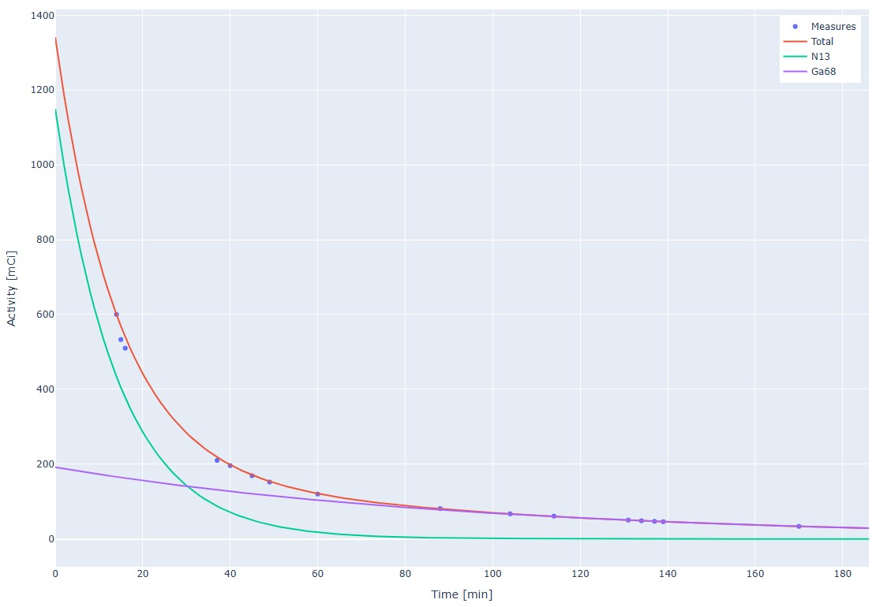

# Decay computation

## Purpose

This project computes the **End Of Beam (EOB)** individual activity of a mix of isotopes produced by a cyclotron.

## Usage

### 1. Data Input

Record the measured activity at different times after the end of production (**EOB : t = 0 min**).  
Enter your data in an Excel file: **`decay_name.xlsx`** inside the '**decayData**' folder. The file name needs to start with **`decay`** and the extension has to be visible. If multiple files respect the formatting, the software will let you choose the one to analyse.
You can input as many decay values as you like in the file (more than 7 is recommended).

### 2. Isotope Selection

The program attempts to identify contributing isotopes from a predefined list of common isotopes.  
You can customize the list directly in **`decay.xlsx`** by checking/unchecking boxes or adding new isotopes (make sure to follow the existing syntax).

### 3. Computation Algorithm

The algorithm iteratively finds the most fitting solution. If negative activity values are found, they are removed one by one.  
Each iteration is logged in **`result.txt`**.

### 4. Final Results

The program computes the theoretical decay curves of the final isotopes and compares them with the measured values.  
Final results are displayed on a local webpage at:

http://localhost:127.0.0.1:56146/

## Execution

You can run the program using:

- The Windows executable: **`decay.exe`**
- Or the Python source code: **`decay.py`**

## Equations

The activity $A(t)$ (number of decays per second) of an individual isotope at time $t$ is defined as:

$$A(t)=\lambda N(t)$$

where:
- $\lambda$  is the decay constant of the isotope.
- $N(t)$ is the number of atoms present at time $t$.

The number of atoms evolves according to the radioactive decay law:

$$N(t)=N_0\, e^{-\lambda t}$$

Combining both expressions gives the activity as a function of time:

$$A(t)=A_0\, e^{-\lambda t}$$

with $A_0=\lambda N_0$ the initial activity.

<ins>**Multiple isotopes**</ins>

If the sample contains several independent isotopes, each with its own decay constant $\lambda_i$ and initial activity $A_{0,i}$, the total activity at time t is: 

$$A_{\mathrm{total}}(t)=\sum_{i=1}^n A_{0,i} e^{-\lambda_i t}$$

By measuring the total activity at different times $t_1,t_2,\dots ,t_m$, you obtain a system of equations: 

$$
\begin{cases}
A_{\text{total}}(t_1) = \sum_i A_{0,i} e^{-\lambda_i t_1} \\
A_{\text{total}}(t_2) = \sum_i A_{0,i} e^{-\lambda_i t_2} \\
\vdots \\
A_{\text{total}}(t_m) = \sum_i A_{0,i} e^{-\lambda_i t_m}
\end{cases}
$$

Solving this system yields the unknown initial activities $A_{0,i}$.

## Feedback

If you encounter incorrect results or have suggestions for improvement, feel free to contact me.