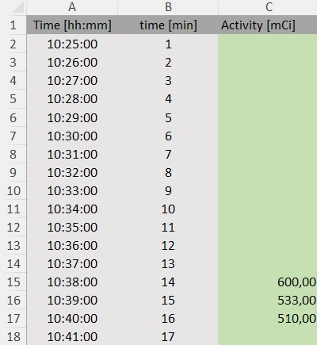

The goal of this project is to compute the End Of Beam (EOB) activity of a mix of isotopes produced by a cyclotron.

You need to record the activity at different times after the production (EOB : t=0min).

You can enter as many values as possible (more than 7) in the excel file "decay.xlsx".

The program will try to find a solution with multiple common isotopes then iterate by removing the negative values. 
It will then compute the theoretical decay of those isotopes and compute the error with the measured values. 
The result will be displayed on a webpage and the iterations saved in the text file "result.txt".