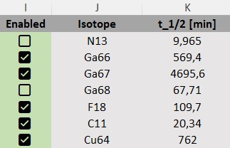
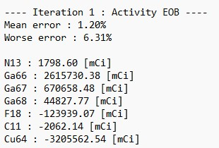
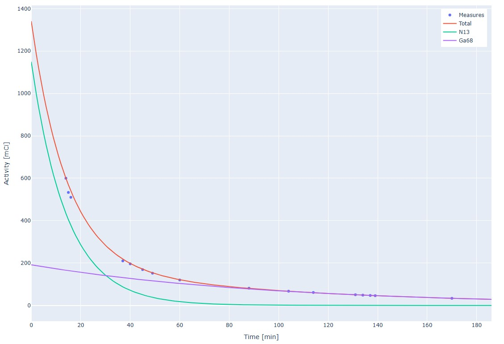

# Decay computation

### The goal of this project is to compute the End Of Beam (EOB) individual activity of a mix of isotopes produced by a cyclotron.

You need to record the activity at different times after the production (EOB : t=0min).

You can enter as many values as possible (more than 7) in the excel file <ins> _decay.xlsx_ </ins>

The program will try to find a solution with multiple common isotopes.

You can change the isotope list by checking the box in the same excel file. You can also add new isotopes (keep the same syntax!).

The algorithm will find solutions with negative amounts of activity. It will iterate and remove those one by one. 
In the <ins> _result.txt_ </ins> file, you can find the different iterations. 

It will then compute the theoretical decay of those isotopes and compute the error with the measured values. 
The final result will be displayed on a local webpage under the url ....

The program can be executed via <ins> _decay.exe_ </ins> but you can also check the source code  <ins> _decay.py_ </ins>.
Don't hesitate to contact me if you get wrong results or if you have suggestions. 